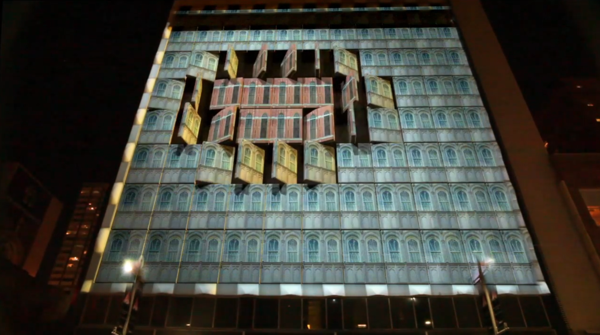
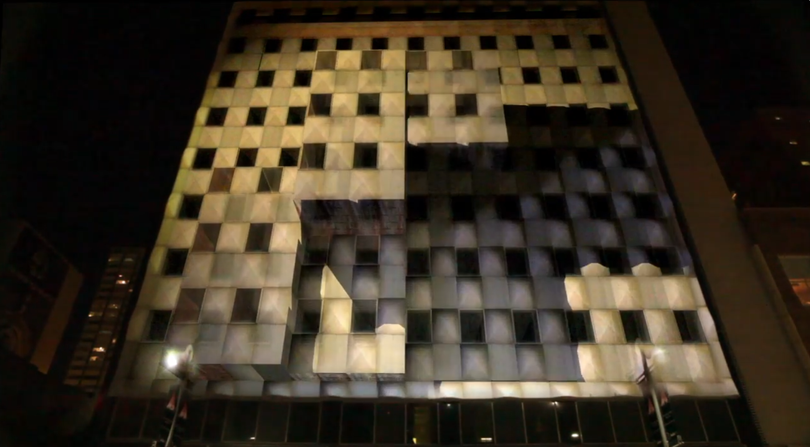
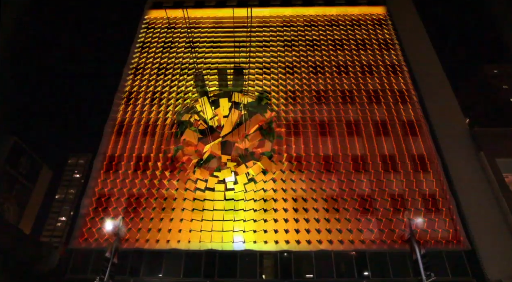
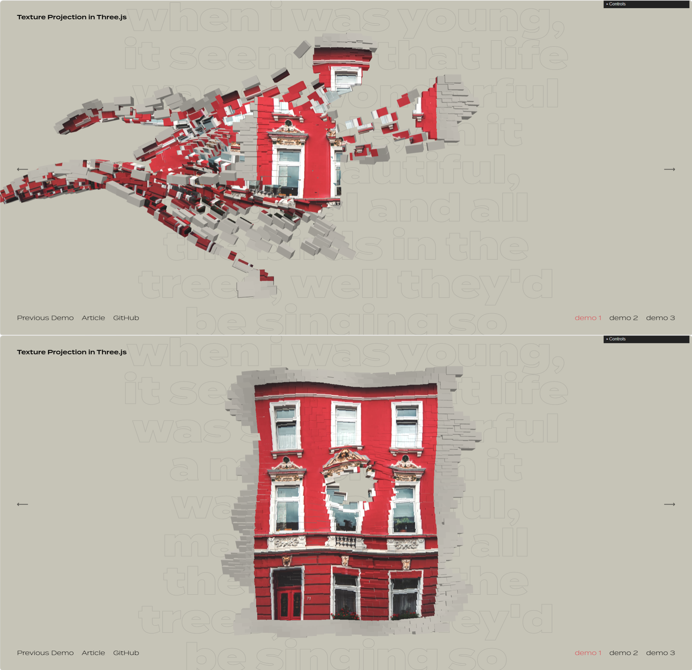

# hagu0731_9103_tut3
My first repository for IDEA9103

This is my first local change to the repo!

# Quiz week 8: Imaging Technique & Coding Technique

## Part 1: Imaging Technique Inspiration

**Chosen technique:** 3D Projection Mapping (on buildings/objects)

I am inspired by how projection mapping warps and blends digital visuals onto complex real-world surfaces like buildings. The precise alignment of graphics with physical edges creates a powerful illusion of transformation. I want to borrow this "surface-driven adaptation" technique, mapping textures to follow a 3D object's shape, making the digital content feel physically embedded.

*Figure 1: Projection mapping on an irregular building facade.*

*Figure 2:  Large-scale 3D architectural projection art.*

*Figure 3: Large-scale 3D architectural projection art on curved surfaces.*

---

## Part 2: Coding Technique Exploration

**Coding technique:** Texture Projection in Three.js

This technique projects a 2D texture onto a 3D model's surface from a virtual camera. In my example, fragments assemble into a house model as the texture maps perfectly onto each piece. When the mouse moves near the model, vertices displace along normals, causing local deformation. The projected texture follows this deformation in real-time without tearing. This recreates projection mapping's core effect—transforming static shapes into dynamic, interactive displays—in the browser.

**Example implementation (existing code from chosen project):**
[https://github.com/marcofugaro/codrops-texture-projection](https://github.com/marcofugaro/codrops-texture-projection)
*The demo I experienced features fragments assembling into a house with mouse-interactive surface deformation.*

**Screenshot of the technique in action:**

*Figure 4:  Screenshot of texture projection showing fragment assembly and mouse-interactive deformation.*